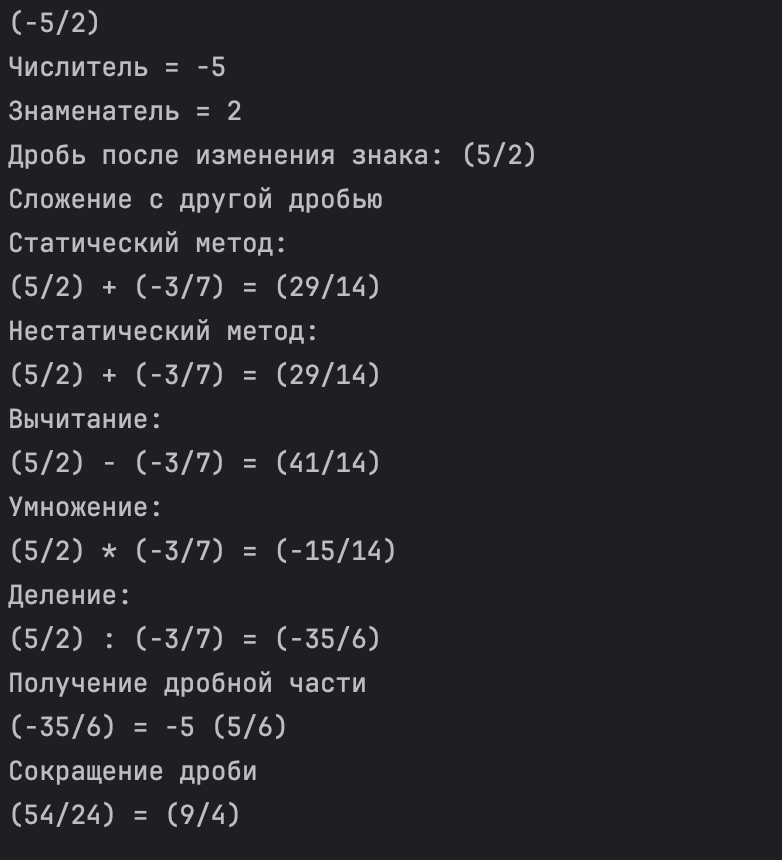

# Задание
## Реализовать класс «обыкновенная дробь».
### Поля:
- числитель – целое, положительное (на усмотрение)
- знаменатель – целое, положительное (на усмотрение)
- знак дроби – подумать над необходимостью и видом в случае реализации
### Методы:
- конструкторы (помните, что знаменатель не должен быть равен 0)
- getters/setters
- изменение знака (по сути умножение на -1)
- сложение с другой дробью (статический/нестатический методы)
- вычитание, умножение, деление
- выделение целой части с ее возвратом из метода и удалением из дроби
- сокращение дроби
- приведение дроби к общему знаменателю с переданной дробью

---

  
